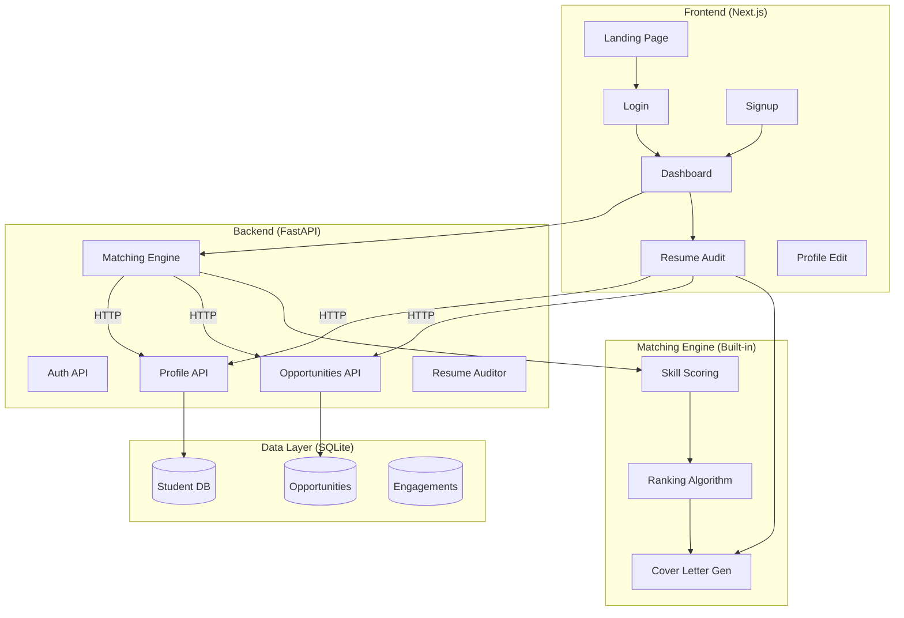

# Hackathon — [DEV ARENA]

- Taken from the official hackathon repository by [GDG,UCE-OU], which serves as the starting point for all participating teams.
- Title of your repository: team-DevBandits

## 👥 Team Details

- **Team Name:** DevBandits
- **Team Lead:** Abdur Rahman Qasim
- **Team Members:**
  - Member 1: Abdur Rahman Qasim (Team Lead)
  - Member 2: Fareed Ahmed Owais
  - Member 3: Mohammed Saad Uddin
  - Member 4: Mohammed Khwaja

---

## Getting Started (Development)

### Step 1 — Fork this Repository
- Click the **Fork** button at the top right of this page
- Select your GitHub account to fork into
- You will be redirected to your own copy of this repository

### Step 2 — Clone your Fork Locally
```bash
git clone https://github.com/your-username/hackathon-repo
cd hackathon-repo
```

### Step 3 — Start Building
- Work on your project inside your forked repository
- Commit and push your changes regularly

```bash
git add .
git commit -m "Your commit message"
git push origin main
```

### Step 4 — Run & Test project locally
```bash
# Backend
cd backend
pip install -r requirements.txt
python -m uvicorn app.main:app --host 0.0.0.0 --port 8000

# Frontend
cd frontend
npm install
npm run dev
```

---

## 🎯 Problem Statement

Internships, hackathons, research openings, and scholarships are scattered across a dozen platforms and notice boards. Students either find out too late, apply for things they are underqualified for, or miss opportunities entirely because no one pointed them in the right direction.

### Description:
Build an AI agent that maintains a profile for each student covering skills, CGPA, year, branch, and goals, and scans opportunity platforms in the background. It filters and ranks results against the student profile and delivers a daily shortlist tailored to them. When a student opens a listing, the agent audits their resume against it and drafts a cover letter or cold email. Over time it learns what the student actually engages with and adjusts accordingly.

---

## 🏛️ Architecture



---

## 🛠️ Tech Stack

### Frontend
- **Framework**: Next.js 15
- **UI**: React 19, Tailwind CSS
- **Language**: TypeScript
- **Components**: shadcn/ui, Lucide React

### Backend
- **Framework**: FastAPI (Python)
- **Database**: SQLite, SQLAlchemy
- **Validation**: Pydantic
- **Server**: Uvicorn

### Dependencies
```
fastapi
uvicorn
sqlalchemy
pydantic
```

---

## 📋 Rules & Regulations

- Use of AI is permitted
- Use of open source libraries is permitted
- Plagiarism will lead to immediate disqualification
- The decision of the judges will be final

### Submission Guidelines
- All code must be pushed to your **forked repository**
- Your repository must be **public**
- **Submission Deadline:** [17th april 3:59pm]

---

## Contact

For any queries, reach out to us at:
- **contact number** : [7981972900]

---

## ✍️ Endnote

> Good luck to all participating teams!